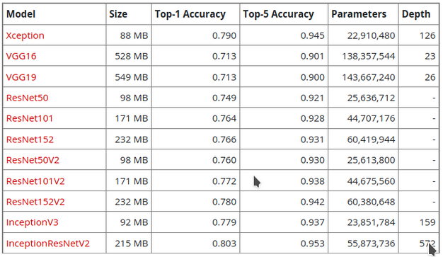

# Feature extraction for images
### Using pre-trained models:
1. Xception
2. ResNet50
3. Inception V3
4. VGG16
5. InceptionResNetV2
### to extract feature vectors for input images
## Comparative study:

